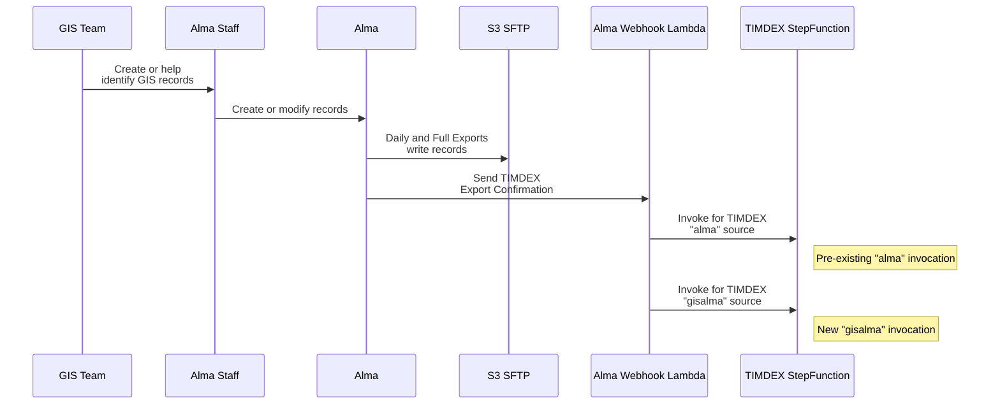
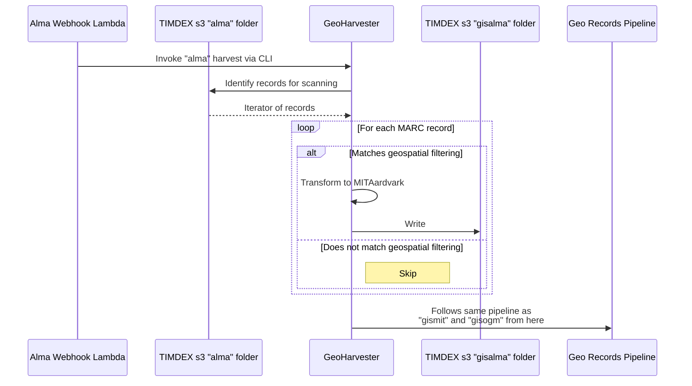

# Alma GIS Harvests

The following are sequence diagrams related to harvesting of GIS data from Alma MARC records.

## Records added or modified in Alma invoking TIMDEX

## GeoHarvester fetching and filtering Alma MARC records for `gisalma` source

