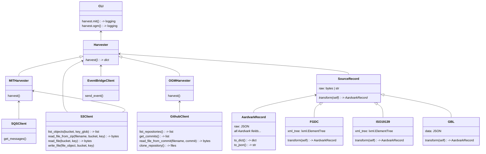

# Geo Harvester Architecture

## Classes

## Entrypoints and Flow

The primary entrypoint for CLI commands will be a `Harvester` instance, which depending on the CLI command `harvester harvest mit` or `harvester harvest ogm`, will either be a `MITHarvester` or `OGMHarvester` respectively.

This `Harvester` instance will then have an entrypoint `harvest` method.  Though differences for MIT vs OGM and "full" vs "incremental" harvests, the rough flow of a harvest will be:

1. Retrieve identifiers to work on
  - MIT: combination of SQS queue and `S3:cdn/restricted/mit` file listing
  - OGM: lean on a configuration YAML and Github API
2. Retrieve source metadata records (e.g. FGDC, ISO19139, Geoblacklight)
  - MIT: from `S3:cdn/restricted/mit`
  - OGM: from Github API and/or repository cloning
3. Normalize to Aardvark JSON records
4. [MIT only] Send EventBridge event indicating if record restricted and/or deleted
5. Package "to-index" and "to-delete" JSON records and write to S3 for Transmogrifier

These flows are detailed more in [MIT Harvests](mit_harvests.md) and [OpenGeoMetadata (OGM) Harvests](ogm_harvests.md).

## Separation of Concerns

Similar to other TIMDEX harvesters like [oai-pmh-harvester](https://github.com/MITLibraries/oai-pmh-harvester) and [browsertrix-harvester](https://github.com/MITLibraries/browsertrix-harvester), this harvester's responsibility is preparing metadata records, in a single format, based on data extracted from a source, and writing to a known location.

In the case of the OAI harvester, the data _is_ metadata and it _is_ already normalized.  Browsertrix performs a web crawl which provides _raw_ data about websites, which is then normalized to a custom XML metadata format.  This harvester will work from metadata records either in S3 (from MIT) or in Github repositories (OGM), but these "source" metadata records will be in a variety of formats.  Therefore, an important duty this harvester performs is normalization to a single format (Aardvark).

All that said, this harvester is unique one important way: **for MIT records, there is connected work of managing actual GIS zip files in S3 based on the results of metadata normalization**.  It is only after this normalization process -- the first time we look closely at the original source metadata -- that we understand if the GIS zip files are public or restricted in nature.  It was decided that this harvester should NOT be responsible for performing this work, but WILL be responsible for sending an event that informs another process to do so.

A StepFunction -- name and code TBD -- will be created that is responsible for managing the actual GIS zip files.  This StepFunction will be providing SQS messages that this harvester READS, informing it what files have been modified and therefore should be harvested for, or removed from, TIMDEX.  Then, after normalization to Aardvark, this harvester will SEND an EventBridge event that informs that StepFunction what further file actions are needed.  In this way, this harvester is responds to and triggers file actions, but does not perform them.
