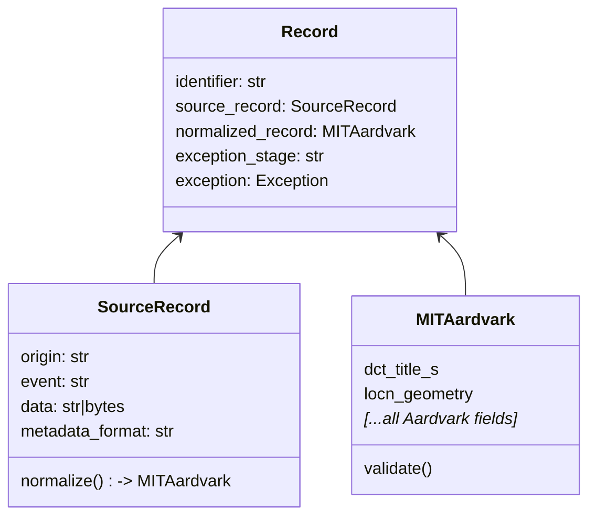
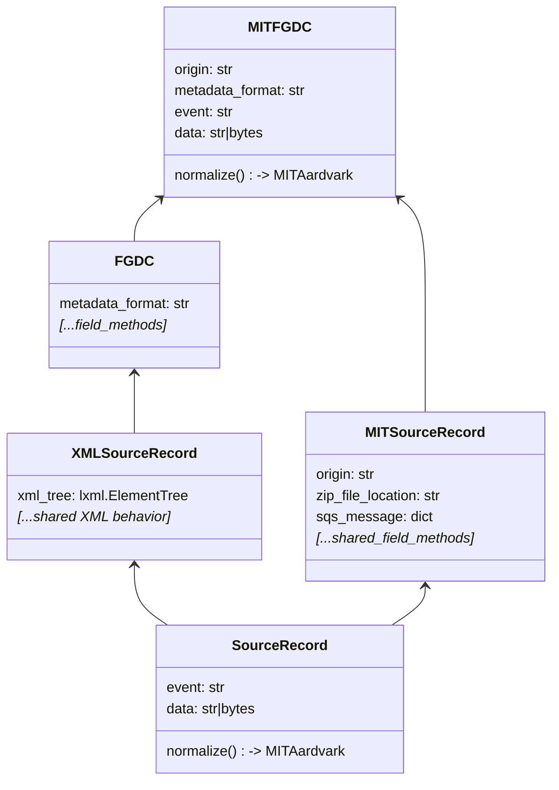
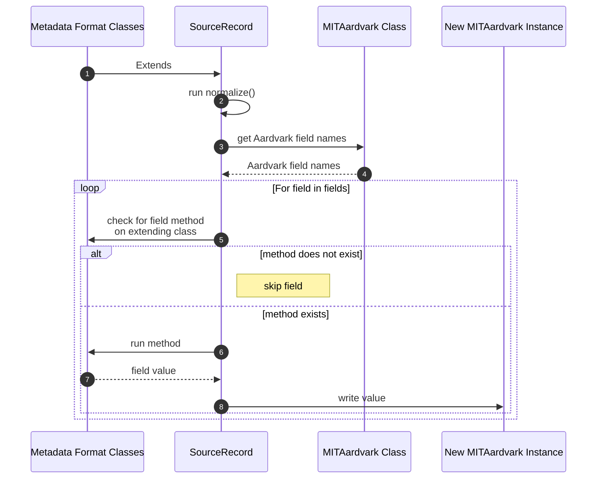

# Metadata Normalization to MIT Aardvark

A primary action performed by this harvester is normalizing metadata records from FGDC, ISO19139, GeoBlacklight 1.x (GBL1), Aardvark,  or MARC formats into an MIT compliant Aardvark metadata record.  These normalized MIT Aardvark records are ultimately what will be indexed into TIMDEX.

## Record Class

- `Record`
  - represents a single geospatial resource
  - attributes `source_record` and `normalized_record` hold its original (source) and normalized metadata records
- `SourceRecord`
  - `Record.source_record`
  - represents the original, source metadata record
  - `normalize()` is the primary entrypoint method for normalization to a new `MITAardvark` instance
  - see more about the creation of `SourceRecords` below
- `MITAardvark`
  - `Record.normalized_record` 
  - represents a normalized form of the source metadata as an MIT-compliant [Aardvark](https://opengeometadata.org/ogm-aardvark/) record
  - this class has all standard Aardvark fields as class fields

## SourceRecord

A `SourceRecord` instance is ultimately a composite class that combines properties and methods from two types of subclasses:
  * Origin
    * classes with behavior specific to the record origin
    * found in `harvester.records.source`
  * Metadata Format
    * classes with behavior specific to the metadata format
    * found in `harvester.records.format`

This arrangement allows for any combination of origin and metadata formats.  Classes layer on additional methods and properties as needed.  

The following shows an example of a `MITFGDC(MITSourceRecord, FGDC)` class used for MIT harvests that inherits from both `MITSourceRecord` (origin) and `FGDC` (metadata format).

Similarly, for OGM harvests you find the class `OGMGBL1(OGMSourceRecord, GBL1)` which inherits logic for OGM harvests and `GBL1` normalization.

## Normalization

Normalization from a "source" record to a "normalized" MITAardvark relies on a tightly coupled naming convention of field names defined in the `MITAardvark` class and methods defined on classes metadata format classes (e.g. `FGDC`, `GBL1`, etc.).

When `SourceRecord.normalize()` is called, field names are retrieved from the `MITAardvark` class.  The method then looks for methods defined by metadata classes that correlate with this field name.  If the method is found, it's run, and the value returned becomes the value in the new `MITAardvark` instance.  

For example, for field `MITAardvark.dct_title_s`, the `SourceRecord.normalize()` method would look for a method `_dct_title_s()` on the extending child class.  If the method does not exist, the field is skipped.  But if present, that method should return a valid value for that field.

Advantages to this approach:
- metadata format specific classes (e.g. `FGDC`, `ISO19139`, etc.) are responsible only for defining methods for fields they can support
- adding or modifying a field in `MITAardvark` is automatically tried during normalization, and will succeed if a corresponding method is defined
- these field methods can be tested directly

Once all field names + methods are exhausted, a new instance of `MITAardvark` is returned, and ultimately stored on the parent `Record` instance.

