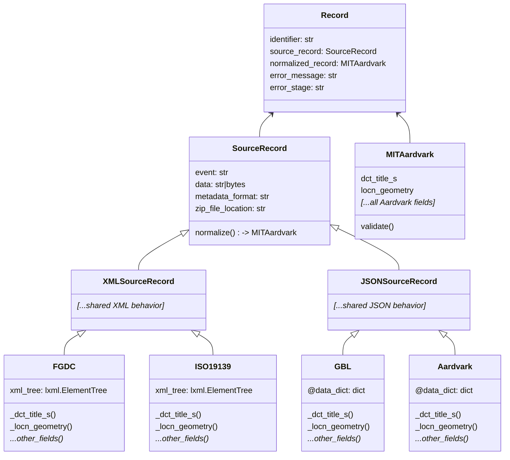
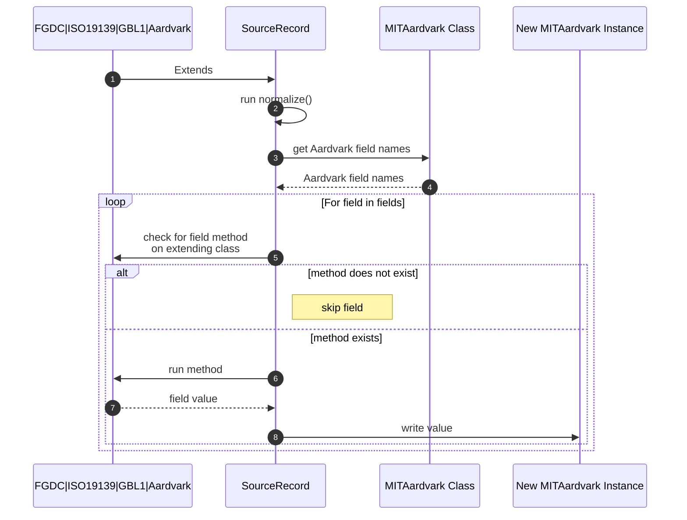

# Metadata Normalization to MIT Aardvark

A primary action performed by this harvester is normalizing metadata records from FGDC, ISO19139, GeoBlacklight 1.x (GBL1), or Aardvark formats into an MIT compliant Aardvark metadata record.  These normalized MIT Aardvark records are ultimately what will be indexed into TIMDEX.

## Record Classes

- `Record`
  - represents a single geospatial resource
  - attributes `source_record` and `normalized_record` hold its original (source) and normalized metadata records
- `SourceRecord`
  - represents the original, source metadata record
  - `normalize()` is the primary entrypoint method for normalization to a new `MITAardvark` instance
  - extended by other classes -- `FGDC`, `ISO19139`, `GBL1`, and `Aardvark` -- that define per-Aardvark field methods that provide values for those fields
- `MITAardvark`
  - represents a normalized form of the source metadata as an MIT-compliant [Aardvark](https://opengeometadata.org/ogm-aardvark/) record
  - this class has ALL standard Aardvark fields as class fields
  - this class ALSO contains a few MIT extensions to the Aardvark format with an `mit_` prefix
- `FGDC`, `ISO19139`, `GBL1`, `Aardvark`
  - classes that extend `SourceRecord` for a given metadata format
  - these classes define methods that return values from the original source data for a new `MITAardvark` record 

## Normalization

Normalization from a "source" record to a "normalized" MITAardvark relies on a tightly coupled naming convention of field names defined in the `MITAardvark` class and methods defined on classes `FGDC`, `ISO19139`, `GBL1`, and `Aardvark` (not MIT Aardvark records) that extend `SourceRecord`.

When `SourceRecord.normalize()` is called, field names are retrieved from the `MITAardvark` class.  The method then looks for methods defined by `FGDC`, `ISO19139`, `GBL1`, and `Aardvark` that correlate with this field name.  If the method is found, it's run, and the value returned becomes the value in the new `MITAardvark` instance.  

For example, for field `MITAardvark.dct_title_s`, the `SourceRecord.normalize()` method would look for a method `_dct_title_s()` on the extending child class.  If the method does not exist, the field is skipped.  But if present, that method should return a valid value for that field.

Advantages to this approach:
- metadata format specific classes (e.g. `FGDC`, `ISO19139`, etc.) are responsible only for defining methods for fields they can support
- adding or modifying a field in `MITAardvark` is automatically tried during normalization, and will succeed if a corresponding method is defined
- these field methods can be tested directly

Once all field names + methods are exhausted, a new instance of `MITAardvark` is returned, and ultimately stored on the parent `Record` instance.

