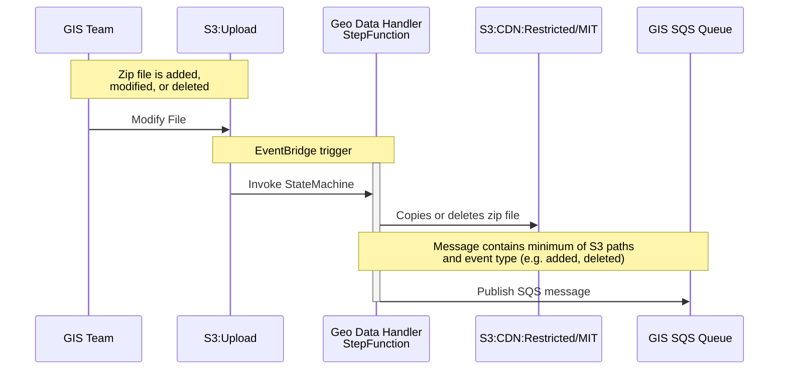
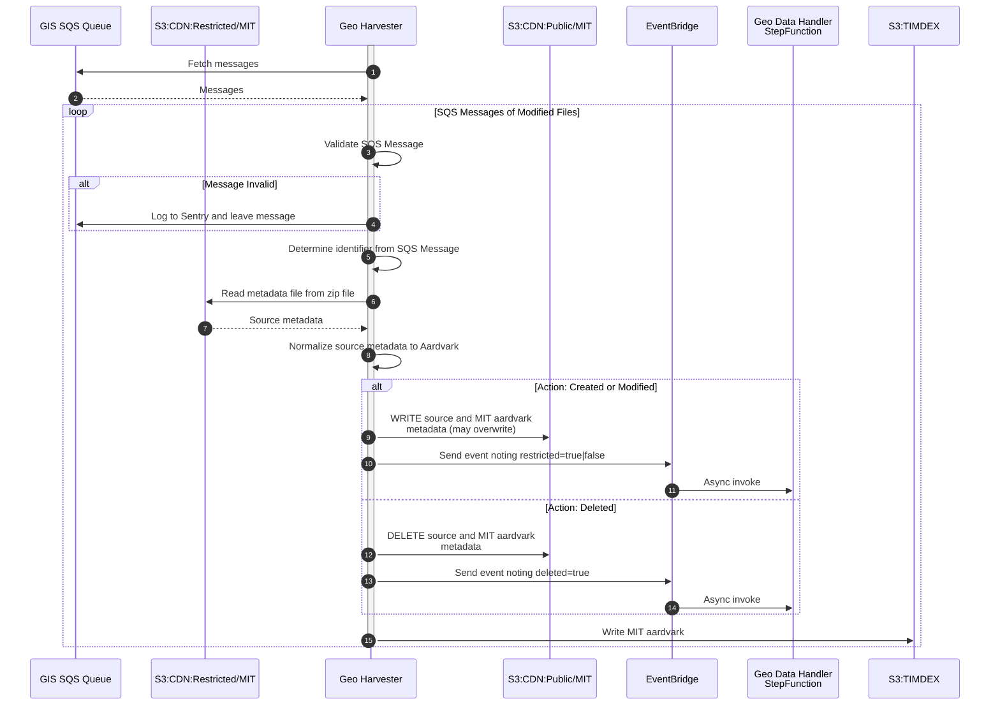
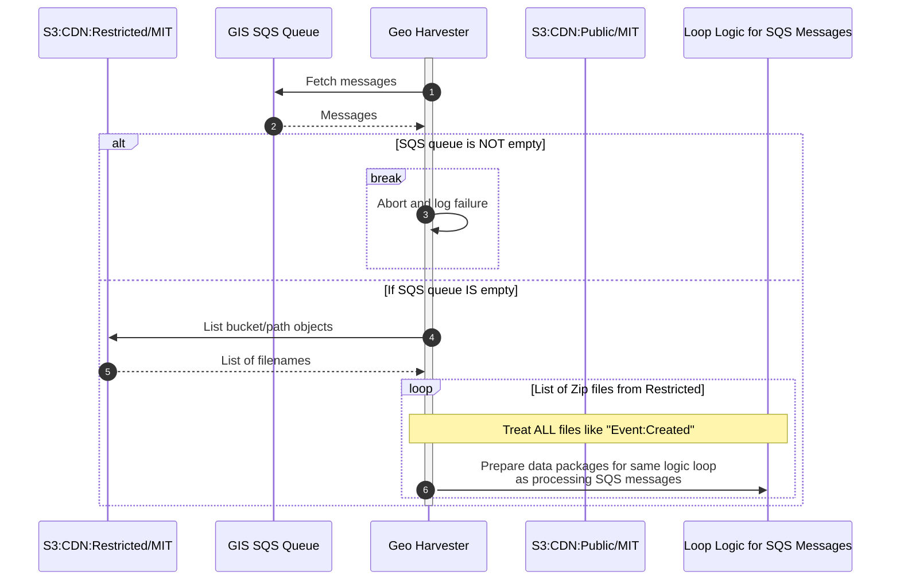

# MIT Harvests

The following are sequence diagrams related to harvesting of MIT GIS data.

## GIS team adds, modifies, or deletes files in S3 Upload bucket

## Incremental Harvest 

The incremental harvest will process any messages currently in an SQS queue that indicate modifications were made to the `S3:CDN:Restricted` bucket.  After normalization, if records are determined to be public, it will send EventBridge events to trigger a StepFunction to copy from `S3:CDN:Restricted` to `S3:CDN:Public`.

## Full Harvest

A full harvest will use the `CDN:Restricted` files as the canonical source, reprocessing all zip files.

