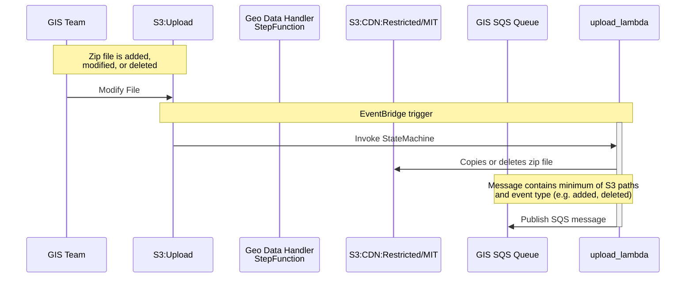
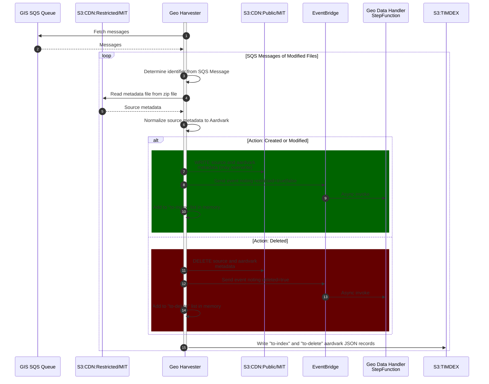

# MIT Harvests

The following are sequence diagrams related to harvesting of MIT GIS data.

## GIS team adds, modifies, or deletes files in S3 Upload bucket

## Incremental Harvest 

The incremental harvest will process any messages currently in an SQS queue that indicate modifications were made to the `S3:CDN:Restricted/MIT` bucket.  As it processes files, it will send events to EventBridge that will trigger another process to move files in and out of the restricted and public CDN buckets.

## Full Harvest

A full harvest will use the `CDN:Restricted` files as the canonical source, reprocessing all zip files.

