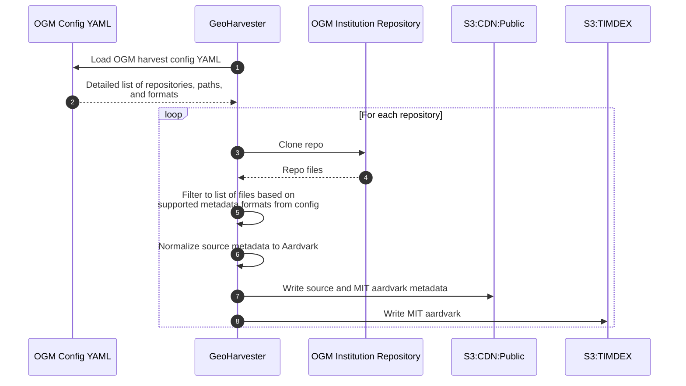
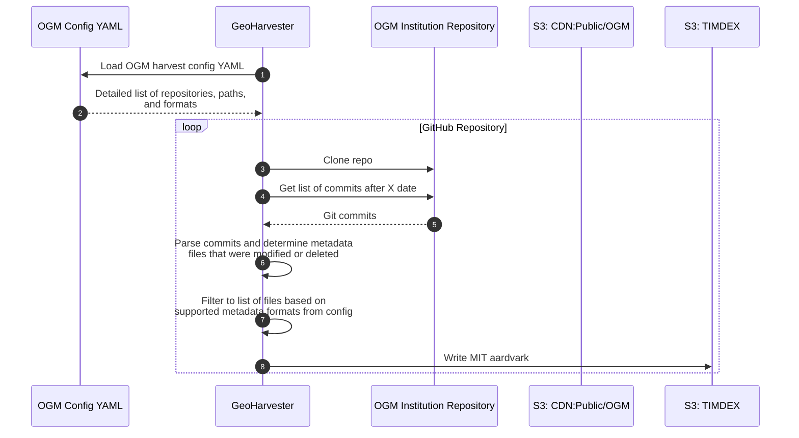

# OpenGeoMetadata (OGM) Harvests

The following are sequence diagrams related to harvesting OpenGeoMetadata (OGM) data.

## Full Harvest

A full harvest from OGM would include retrieving metadata from ALL repositories, and ALL metadata file formats, we are configured to harvest from.

## Daily (Incremental) Harvest

A daily (incremental) will rely on git commits to pickup changes to repositories after the run date specified.

